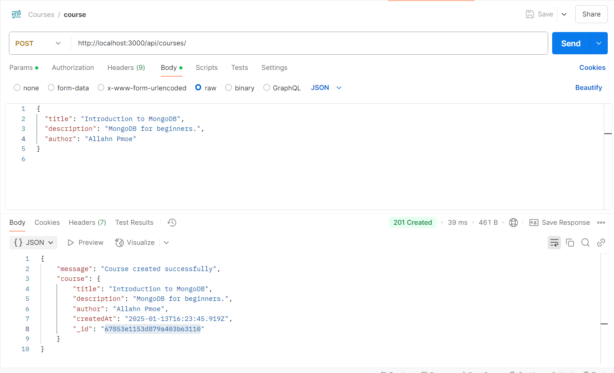
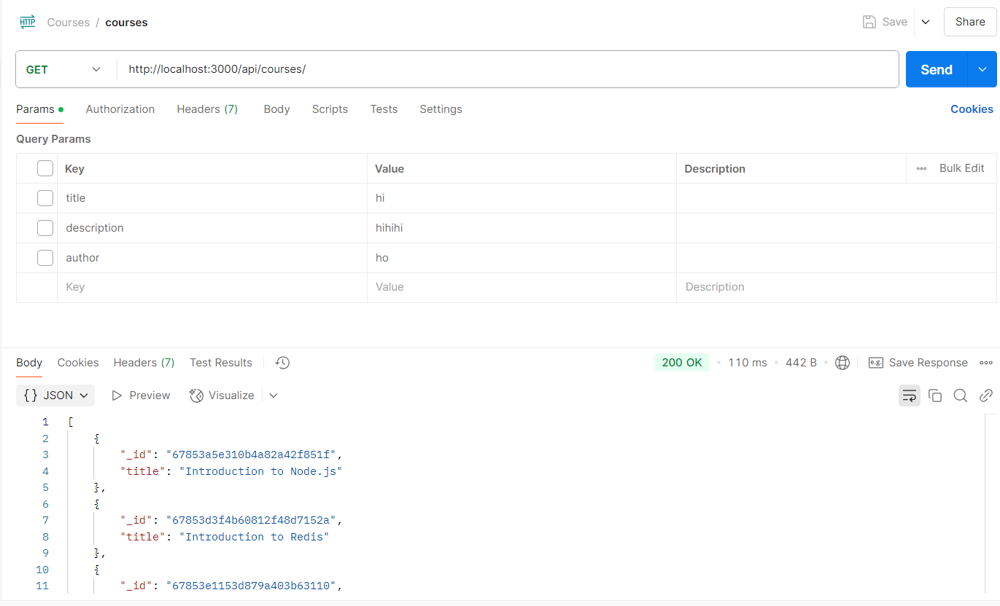
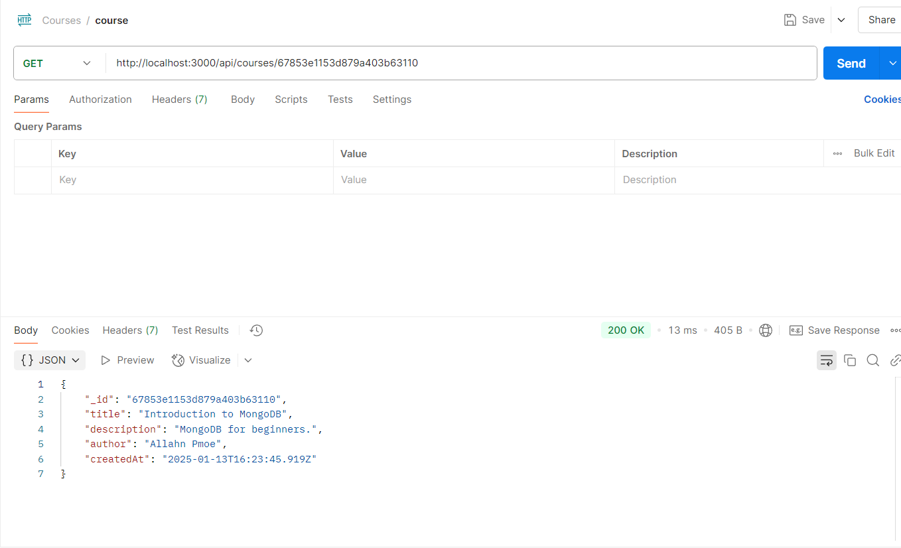
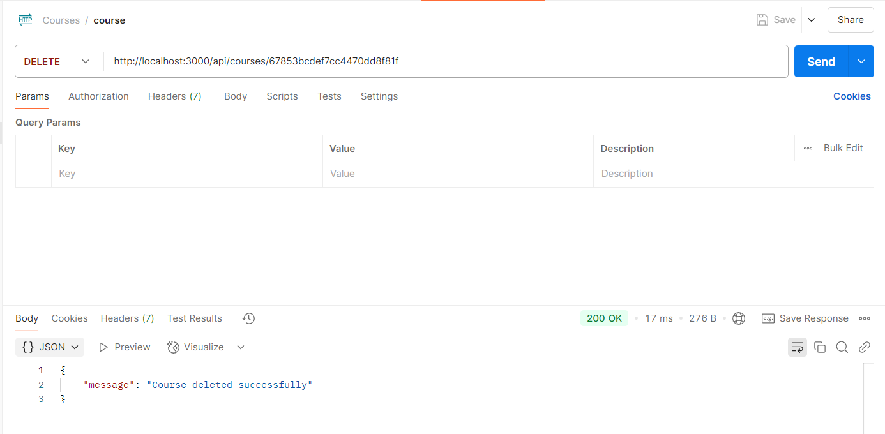

# Learning Platform Project  

Ce projet est une plateforme d'apprentissage qui utilise **MongoDB**, **Redis** et **Node.js** pour gérer les cours.  

---

## 🛠️ Installation et lancement du projet  

### **Prérequis**  
- **Node.js** version 14 ou supérieure  
- **MongoDB** et **Redis** installés localement ou accessibles via une URI distante  

### **Étapes d'installation**  
1. Création de votre dépôt :
   - Sur Github.com
   - Créez un nouveau dépôt public
   - Nommez-le "learning-platform-nosql"
   - Ne l'initialisez pas avec un README pour le moment

2. Configuration de votre environnement local :
   ```bash
   # Clonez mon dépôt template (ce dépôt)
   git clone https://github.com/chaymaAitB/learning-platform-template
   
   # Renommez le dépôt origin
   cd learning-platform-template
   git remote remove origin
   
   # Ajoutez votre dépôt comme nouvelle origine
   git remote add origin https://github.com/[votre-compte]/learning-platform-nosql
   
   # Poussez le code vers votre dépôt
   git push -u origin main
   ```

3. Installation des dépendances :
   ```bash
   npm install
   ```
   
## 📂 Structure du projet
```plaintext
📂 learning-platform
├── 📁 config          # Fichiers de configuration pour MongoDB, Redis, etc.
│   ├── db.js          # Connexions à MongoDB et Redis
│   └── env.js         # Chargement des variables d'environnement
├── 📁 controllers     # Logique métier des API
│   └── courseController.js  # Contrôleurs pour les opérations sur les cours
├── 📁 routes          # Définition des routes de l'API
│   └── courseRoutes.js       # Routes pour les opérations sur les cours
├── 📁 services        # Services pour interagir avec MongoDB et Redis
│   ├── mongoService.js       # Fonctions MongoDB
│   └── redisService.js       # Fonctions Redis
├── 📁 models          # Modèles pour MongoDB (à ajouter si nécessaire)
├── 📄 package.json     # Dépendances et scripts
├── 📄 package-lock.json # Verrouillage des versions des dépendances
├── 📄 .env.example     # Exemple de fichier d'environnement
├── 📄 README.md        # Documentation du projet
└── 📄 server.js        # Point d'entrée de l'application
```

## ✨ Choix techniques

### **MongoDB** :
- Utilisé pour stocker les cours de manière structurée.
- **Avantages** : Scalabilité et support des requêtes complexes.

### **Redis** :
- Utilisé pour la mise en cache des cours pour améliorer les performances.
- **Avantages** : Faible latence pour les données fréquemment consultées.

### **Node.js avec Express** :
- Permet une configuration rapide et flexible des APIs RESTful.

### **Postman** :
- Utilisé pour tester les APIs en local de manière rapide et efficace.
- **Avantages** : Interface graphique intuitive, possibilité d'automatiser les tests d'API, support pour la gestion de variables d'environnement et l'import/export de collections de requêtes.

### **Architecture** :
- Basée sur une séparation claire entre les **routes**, les **contrôleurs**, et les **services** pour un code maintenable.

## ❓ Réponses aux questions posées dans les commentaires  

- **Question** : Pourquoi créer un module séparé pour les connexions aux bases de données ?  
  **Réponse** : Pour centraliser la gestion des connexions, améliorer la réutilisabilité du code, et simplifier le maintien et le débogage de l'application.

- **Question** : Comment gérer proprement la fermeture des connexions ?  
  **Réponse** : En écoutant les événements système (comme `process.on('SIGINT')` ou `SIGTERM`) pour fermer les connexions avec des méthodes comme `client.close()` pour MongoDB et `client.quit()` pour Redis.

- **Question** : Pourquoi est-il important de valider les variables d'environnement au démarrage ?  
  **Réponse** : Pour éviter des erreurs inattendues pendant l'exécution de l'application en s'assurant que toutes les variables essentielles sont bien définies.

- **Question** : Que se passe-t-il si une variable requise est manquante ?  
  **Réponse** : L'application pourrait planter ou se comporter de manière imprévisible, rendant le débogage plus difficile.

- **Question** : Quelle est la différence entre un contrôleur et une route ?  
  **Réponse** : Une route définit l'URL et la méthode HTTP pour accéder à une fonctionnalité, tandis qu'un contrôleur contient la logique métier qui est exécutée lorsque la route est appelée.

- **Question** : Pourquoi séparer la logique métier des routes ?  
  **Réponse** : Pour une meilleure organisation, réutilisation du code, et testabilité. Cela permet également de rendre le code plus clair et maintenable.

- **Question** : Pourquoi séparer les routes dans différents fichiers ?  
  **Réponse** : Cela favorise la modularité, la lisibilité, et la maintenabilité. Chaque module gère un ensemble spécifique de routes, évitant ainsi un fichier `app.js` surchargé.

- **Question** : Comment organiser les routes de manière cohérente ?  
  **Réponse** : Utilisez une structure de dossiers claire, par exemple, un dossier `routes` avec des fichiers nommés selon leur fonction (ex. `courseRoutes.js`).

- **Question** : Pourquoi créer des services séparés ?  
  **Réponse** : Pour centraliser et réutiliser la logique métier, faciliter la maintenance et réduire la duplication de code.

- **Question** : Comment gérer efficacement le cache avec Redis ?  
  **Réponse** : En configurant des TTL (Time-To-Live) adaptés pour les clés, en utilisant des structures de données optimisées (ex. `hashes`, `sets`), et en invalidant les caches obsolètes.

- **Question** : Quelles sont les bonnes pratiques pour les clés Redis ?  
  **Réponse** : Utiliser des noms de clés descriptifs et organisés (ex. `user:123:data`), éviter des clés trop longues, et gérer leur durée de vie (TTL).

- **Question** : Comment organiser le point d'entrée de l'application ?  
  **Réponse** : Le point d'entrée doit être organisé pour initialiser les bases de données, configurer les middlewares, monter les routes, et démarrer le serveur. Cela améliore la lisibilité, la maintenabilité et facilite le débogage.

- **Question** : Quelle est la meilleure façon de gérer le démarrage de l'application ?  
  **Réponse** : Utiliser une fonction asynchrone pour gérer les connexions aux bases de données et configurer le serveur, avec une gestion appropriée des erreurs.

- **Question** : Quelles sont les informations sensibles à ne jamais commiter ?  
  **Réponse** : Les informations sensibles qu’il faut éviter de commiter incluent :
  - Identifiants d’accès et secrets : `MONGODB_URI` et `REDIS_URI`
  - Clés secrètes : Toute clé d’authentification comme `JWT_SECRET` ou des clés d’API.

- **Question** : Pourquoi utiliser des variables d'environnement ?  
  **Réponse** : L’utilisation des variables d’environnement présente plusieurs avantages :
  - **Sécurité** : Garder les informations sensibles hors du code source.
  - **Flexibilité** : Adapter facilement les configurations à différents environnements.
  - **Portabilité** : Faciliter le déploiement sur différents systèmes sans modification du code.
  - **Facilité de maintenance** : Gérer facilement les configurations.

- **Question** : Quoi mettre dans `.gitignore` et qu'est-ce que ce fichier ?  
  **Réponse** : Le fichier `.gitignore` permet d'indiquer à Git quels fichiers ou répertoires ne doivent pas être suivis.  
  Voici des exemples de fichiers à ignorer :
  - `node_modules/` : Répertoire contenant les dépendances installées via npm.
  - `.env` : Fichier contenant les variables d’environnement.
  - `logs/` : Répertoires générant des fichiers de log.
  - `.DS_Store` : Fichier créé par macOS pour stocker des attributs personnalisés de dossiers.
  - `*.log` : Fichiers de log.

## 📚 Documentation de l'API

### Créer un cours
**POST** `/api/courses`

**Body** :
```json
{
  "title": "Titre du cours",
  "description": "Description",
  "author": "Auteur"
}
```

**Demonstration** :


### Lister les cours
**GET** `/api/courses`

**Demonstration** :


### Consulter un cours
**GET** `/api/courses/:id`

**Demonstration** :


### Supprimer un cours
**DELETE** `/api/courses/:id`

**Demonstration** :


#### N'hésitez pas à poser des questions ou proposer des améliorations ! 😊
